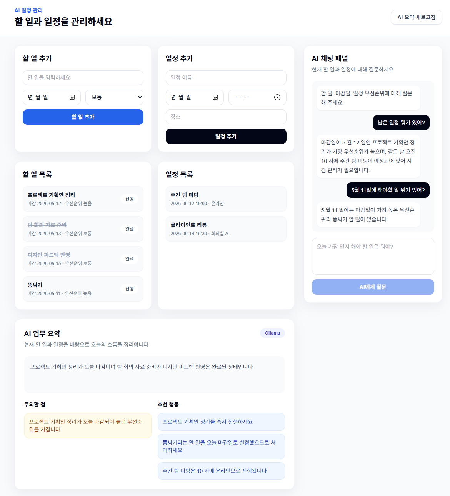

# AI 일정 관리 앱

할 일을 추가하고 일정을 관리하는 로컬 AI 웹 앱입니다.



- 프론트엔드: Next.js, TypeScript, Tailwind CSS
- 백엔드: FastAPI
- LLM: Ollama
- 모델: `qwen3.5:9b`
- 주요 기능: 할 일 추가, 일정 추가, 완료 처리, AI 업무 요약, AI 채팅

## 파일 구조

```text
.
|-- README.md
|-- main.py
|-- docs
|   `-- assets
|       `-- app-screenshot.png
|-- backend
|   |-- .env.example
|   |-- Procfile
|   |-- railway.json
|   |-- requirements.txt
|   |-- runtime.txt
|   `-- app
|       |-- __init__.py
|       |-- config.py
|       |-- main.py
|       |-- ollama.py
|       `-- schemas.py
`-- frontend
    |-- .env.local.example
    |-- eslint.config.mjs
    |-- next-env.d.ts
    |-- next.config.ts
    |-- package.json
    |-- package-lock.json
    |-- postcss.config.mjs
    |-- tailwind.config.ts
    |-- tsconfig.json
    `-- src
        |-- app
        |   |-- globals.css
        |   |-- layout.tsx
        |   `-- page.tsx
        |-- components
        |   |-- AiChatPanel.tsx
        |   `-- AiSummaryCard.tsx
        |-- data
        |   `-- dashboard.ts
        |-- lib
        |   `-- api.ts
        `-- types
            |-- chat.ts
            `-- dashboard.ts
```

## 아키텍처

```text
Vercel frontend
→ Railway FastAPI backend
→ ngrok Ollama URL
→ local Ollama
```

Railway에는 FastAPI 백엔드만 배포합니다. Ollama는 Railway에 같이 올라가지 않습니다. 로컬 PC에서 Ollama를 실행하고 ngrok으로 `11434` 포트를 공개한 뒤, 그 URL을 Railway 환경 변수에 넣습니다.

## Railway 백엔드 배포

Railway에서 새 서비스를 만들고 GitHub 저장소를 연결합니다.

설정:

```text
Root Directory: backend
Builder: Nixpacks
Start Command: python -m uvicorn app.main:app --host 0.0.0.0 --port $PORT
Healthcheck Path: /health
```

이 저장소에는 Railway용 파일이 이미 들어 있습니다.

```text
backend/Procfile
backend/railway.json
backend/runtime.txt
```

Railway 환경 변수:

```text
APP_OLLAMA_BASE_URL=https://your-ngrok-url.ngrok-free.app
APP_OLLAMA_MODEL=qwen3.5:9b
APP_CORS_ORIGINS=["https://your-vercel-app.vercel.app"]
```

주의할 점:

```text
APP_OLLAMA_BASE_URL=http://localhost:11434
```

이 값은 Railway에서 쓰면 안 됩니다. Railway의 `localhost`는 네 컴퓨터가 아니라 Railway 컨테이너 자신입니다.

## ngrok으로 Ollama 공개

로컬 PC에서 Ollama를 실행합니다.

```powershell
ollama serve
```

다른 터미널에서 ngrok을 실행합니다.

```powershell
ngrok http 11434
```

ngrok이 보여주는 HTTPS URL을 Railway의 `APP_OLLAMA_BASE_URL`에 넣습니다.

예:

```text
APP_OLLAMA_BASE_URL=https://abc123.ngrok-free.app
```

## Vercel 프론트엔드 설정

Vercel에는 `frontend` 폴더를 배포합니다.

```text
Root Directory: frontend
Build Command: npm run build
Install Command: npm install
Output Directory: .next
```

Vercel 환경 변수:

```text
NEXT_PUBLIC_API_BASE_URL=https://your-railway-backend.up.railway.app
```

## 로컬 실행

Ollama:

```powershell
ollama pull qwen3.5:9b
ollama serve
```

백엔드:

```powershell
cd C:\Users\pc\Desktop\tjrwldnjs\backend
.\.venv\Scripts\python.exe -m pip install -r requirements.txt
.\.venv\Scripts\python.exe -m uvicorn app.main:app --reload --port 8000
```

프론트엔드:

```powershell
cd C:\Users\pc\Desktop\tjrwldnjs\frontend
npm.cmd install
npm.cmd run dev
```

브라우저에서 엽니다.

```text
http://localhost:3000
```
